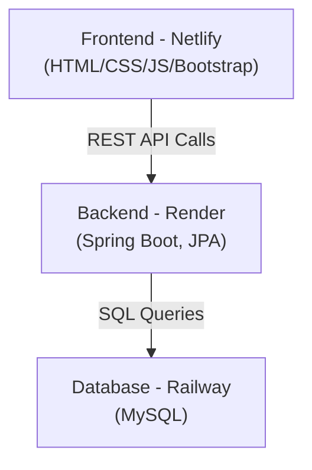

# 🎨 Course Registration System – Frontend  

A responsive **frontend web application** for the Course Registration System, built with **HTML, CSS, Bootstrap, and JavaScript**.  
This frontend connects seamlessly to the backend API (**Spring Boot + MySQL**).  

🔗 **Live Demo**: [Course Registration System](https://course-register-system.netlify.app)  

---

## 🚀 Deployment Architecture  

- **Frontend (HTML/CSS/JS/Bootstrap)** → Deployed on **Netlify**  
- **Backend API (Spring Boot + JPA + MySQL)** → Deployed on **Render**  
- **Database (MySQL)** → Hosted on **Railway**  

---

## 🏗️ System Architecture  



## ✨ Features  

📌 Clean & modern **Bootstrap-based UI**  

📋 View all available courses in a **responsive layout**  

📝 Register students into courses via backend API  

👨‍🎓 View list of **enrolled students** (fetched dynamically)  

🌍 Fully responsive design (desktop + mobile friendly)  

⚡ Deployed on **Netlify** for instant global access  

---

## 🛠️ Tech Stack  

- **Frontend:** HTML5, CSS3, Bootstrap 5, JavaScript  
- **Deployment:** Netlify  
- **API Integration:** REST API from Backend Repo  

---

## 📸 Screenshots  

**Landing Page**  
  

**Course List**  
  

**Registration Form**  
  

---

## 📂 Project Structure  

```bash
course-frontend/
│── index.html      
│── availcourses.html       
│── script.js       # Frontend logic & API calls
│── enrolled.html
│── register.html
│── README.md
```
## ⚡ Setup Instructions
### 1️⃣ Clone the repository
```bash
git clone https://github.com/seshathri044/course-frontend.git
cd course-frontend
```
### 2️⃣ Run locally
Just open index.html in your browser, or use a local server:

### 3️⃣ Deployment (Netlify)
- Login to Netlify
- Connect GitHub repo & select course-frontend
- Netlify auto-deploys on every push

## 🔗 API Integration  

This frontend consumes APIs from the **backend repo** 👉 [course-backend](https://github.com/seshathri044/course-backend)  

| Action           | API Used                 |
|------------------|--------------------------|
| List Courses     | GET `/courses`           |
| Register Student | POST `/courses/register` |
| View Enrolled    | GET `/courses/enrolled`  |

### 🔄 Repo Navigation

Frontend Repo 👉 [course-frontend](https://github.com/seshathri044/course-frontend)

Backend Repo 👉 [course-backend](https://github.com/seshathri044/course-backend)

### 🤝 Contributing
- Contributions are welcome!
- Fork the repo
- Create your feature branch: git checkout -b feature/awesome-feature
- Commit your changes: git commit -m 'Add awesome feature'
- Push the branch: git push origin feature/awesome-feature
- Open a Pull Request

### 📜 License
This project is licensed under the MIT License – see the LICENSE file for details.
